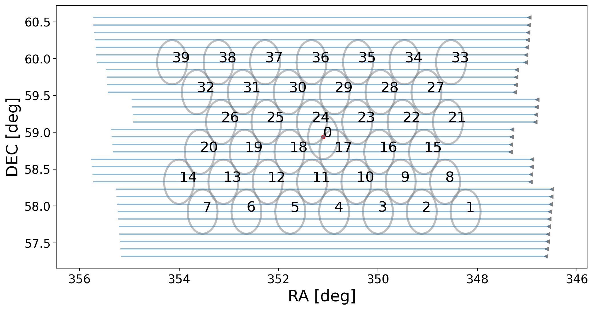

aperdrift
===========
[](https://zenodo.org/badge/latestdoi/182954402) \
2 Aug 22: [Dénes et al.](https://arxiv.org/abs/2205.09662) has been accepted for publication in A&A.

Introduction
------------
Python code to generate a schedule for Apertif driftscans.

The program reads the Apertif beam pattern from a .txt file in ancillary/ and creates a drift scan schedule for a user specified calibrator and time**, and user specified number of drifts per beam***.

The properties of the Apertif beams derived from driftscans are described in: \
[Dénes, H., Hess, K. M., Adams, E. A. K., et al., "Characterising the Apertif primary beam response", accepted to A&A](https://arxiv.org/abs/2205.09662)

The code used for modeling the Apertif compound beams from the driftscan autocorrelations can be found [here](https://github.com/helgadenes/aperPB). 

Requirements
------------
The code requires Python 3.

Python dependencies can be installed with: 

 ```
 pip install -r requirements.txt
 ```
 
Installation
------------

Fork to your own repository and do a git clone (nothing fancy).

Usage
-----
```
$ python3 aperdrift.py -h

usage: aperdrift.py [-h] [-d DRIFTS_PER_BEAM] [-c CALIB] [-s STARTTIME_UTC] [-o OUTPUT] [-v]

Make a driftscan schedule for the Apertif imaging surveys.

optional arguments:
  -h, --help            show this help message and exit
  -d DRIFTS_PER_BEAM, --drifts_per_beam DRIFTS_PER_BEAM
                        Specify the number of drifts per beam line (default: 1).
                         1 & even numbers drift through bm00.
  -c CALIB, --calib CALIB
                        Specify the calibrator. (default: 3C147).
  -s STARTTIME_UTC, --starttime_utc STARTTIME_UTC
                        The start time in ** UTC ** ! - format 'YYYY-MM-DD HH:MM:SS' (default: '2019-04-25 16:00:00').
  -o OUTPUT, --output OUTPUT
                        Specify the root of output csv and png files (default: CALname_driftDATE_temp.csv.)
  -v, --verbose         If option is included, print time estimate for several drift combos.

```

Output
------
The program creates:
* a csv file formatted in the manner of an Apertif scheduling parameter file,
* a png file of the driftscan layout.



Notes
-----
** The program will make an observing schedule for any calibrator/time combination.  If a calibrator is not actually above the observing horizon (HA = +/-6 hours), it will throw a warning but still write the csv file.

*** Number of drifts per beam is an imprecise description.  It really means the number of drifts between beam centers + 1 (counting one of the beam centers). 

Version history
---------------
* aperdrift v1.0.0
  * Released 13 May 2022
  
Authors
-------
Kelley M. Hess and Helga Dénes

Reference
---------
When referring to aperdrift in publications, please cite both the Zenodo DOI for the code, and the following paper: \
[Dénes, H., Hess, K. M., Adams, E. A. K., et al., "Characterising the Apertif primary beam response", accepted to A&A](https://arxiv.org/abs/2205.09662)

Copyright and license
---------------------

© 2022 Kelley M. Hess

This programme is free software: you can redistribute it and/or modify it 
under the terms of the GNU General Public License as published by the Free 
Software Foundation, either version 3 of the License, or (at your option) any 
later version.

This programme is distributed in the hope that it will be useful, but **without 
any warranty**; without even the implied warranty of **merchantability** or **fitness 
for a particular purpose**. See the GNU General Public License for more details.

You should have received a copy of the GNU General Public License along with 
this programme. If not, see http://www.gnu.org/licenses/.
